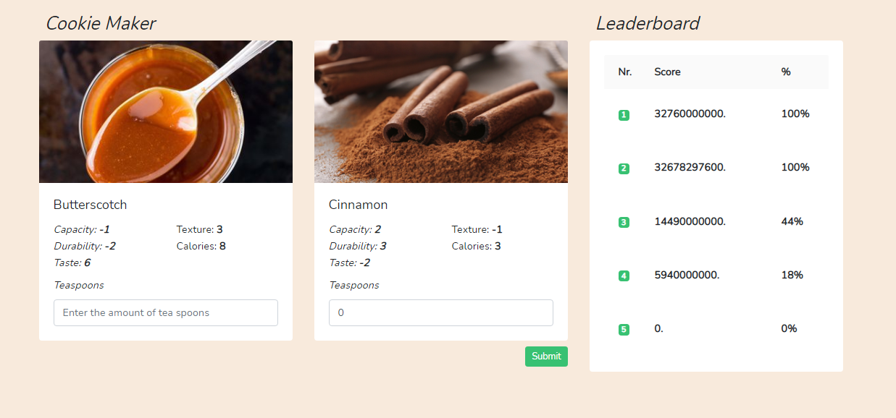

## Socialblue Assignment:
Hi, thanks for having this opportunity, this repository was made by @ndottens.
In this project you can try to make your perfect cookie. You can currently use 2 ingredients with each of their own stats.

> You have to create the perfect cookie in order to achieve the highest score possible.

## About this project:
This project was made in laravel and vue, the front-end communicates with a laravel api.

## Project Structure

Here you can find the project structure.

    
    ├── app
    │     ├── Enums # We use enums because we want to have a global file for hardcoded input.
    │     │     ├─ IngredientName
    │     │     └─ JsonMessages
    │     ├── Http
    │     │     ├─ Controllers 
    │     │     │     └─ RecipeController # Here we have our controller for our functions
    │     │     ├─ Services
    │     │     │     └─ RecipeService # We use a service because we want to have a clean as possible controller.
    │     │        └─ Requests 
    │     │              └─ RecipeRequest # We use a custom request to validate our request and also secure it a bit more.
    │     │ 
    │     └── Models 
    │           ├─ Ingredient # Ingredient model for our ingredients and stats details.
    │           └─ Recipe # Recipe model to store our recipe combinations and score.    
    │   
    ├── resources             
            └── js         
                ├─ components # For our custom components
                ├─ module 
                     └─ Recipe # We have a global file for our axios requests
                └─ pages 
   

## Install guide:

- cp .env.example .env
- composer install
- npm install
- php artisan migrate
- php artisan db:seed

